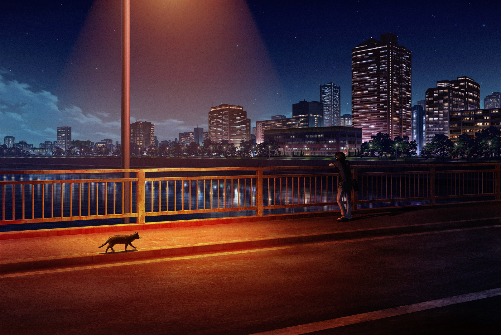
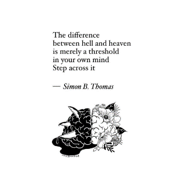
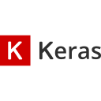

<h2 align="left">Hi 😉! My name is Thomas and I'm a Computer Science Engineer.</h2>

    

 

    
    
    
  

###

  

---

###

<h3 align="left">👩‍💻  About Me</h3>

<table>
  <tr>
    <td style="text-align: left; vertical-align: top;">
      
- 🇨🇱  I'm from Chile

      
- 💻 I am an undergraduate student at PUCV.

      
- 🏋️‍♂️ To clear my mind I go to the gym.

      
- ⛩ I love Asian culture, especially Japanese.

      
- ⏳ The phrase that defines me is, <em>'Don't regret your decisions.'</em> 

    </td>
    <td style="text-align: right; vertical-align: top;">
      
    </td>
  </tr>
</table>

<h3 align="left">🔍 Areas of professional interest <h3>

<h4>👩‍💻 In Computer Science:</h4>

- Artificial Inteligence.

- Software Depelopment.

- Problem Optimization.

<h4>🎲 Others:</h4>

- Psychology.

- Biology (Neuroscience).

---

###

<h3 align="left">🛠 Language and tools</h3>

###

  
  
  
  
  
  
  
  
  
  
  
  
  
  
  
  
  
  
  
  
  

###

<h3 align="left">💪 My Stats :</h3>

###

  
  

<!--

###

 

###

icons: https://github.com/devicons/devicon/blob/v2.16.0/icons/

-->
